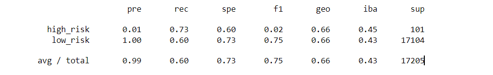

# Credit_Risk_Analysis
## Overview
### Sampling
There are various techniques to sample data in supervised machine learning. Typically these oversampling, undersampling or combination techniques are employed to resolve class imbalance issues in which the existing classes in the dataset aren't equally represented. This could look like a dataset in which there are significantly more cases of one outcome than the other.
#### Oversampling
Oversampling techniques duplicate or mimic data points from the minority class until it has equal points to the majority class in a training dataset. The issue with oversampling is that the machine can become biased toward the majority class. Two methods of oversampling are random oversampling and synthetic minority oversampling technique (SMOTE).
#### Undersampling
Undersampling techniques drop points from the majority class until it has equal points to the minority class in a training dataset. Unlike oversampling, undersampling only uses real data, but the tradeoff is that real majority class data is lost. Two methods of undersampling are random undersampling and cluster centroid undersampling.
#### Combination Sampling
SMOTEENN is a sampling method that utilizes aspects of both over and undersampling. SOMTEENN oversamples the miniority class with SMOTE and then cleans the resulting data with undersampling to drop some of the dataset's outliers, resulting in more cleanly separated classes in a dataset.
### Ensemble Learning
Ensemble learning is the process of using "multiple learning algorithms to obtain better predictive performance than could be obtained from any of the constituent learning algorithms alone".[1] Ideally, these ensemble learning builds can improve the accuracy and robustness of the model, decrease its variance, resulting in increased overall performance.
#### Balanced Random Forest Classifier
Random forests are one kind of of bagging ensemble learning build. A random forest is a "model made up of a large number of small decision trees, called estimators, which each produce their own predictions", where the combination of these predictions ideally results in the algorithm's more accurate prediction.[2] A balanced random forest randomly undersamples each decision tree sample to balance it.[3]
#### Easy Ensemble Classifier
AdaBoost learners are a kind of boosting ensemble learning build where in which each successive model instance emphasizes training instances in which previous models mis-classified.<[1] Easy Ensemble Classifier is an AdaBoost learner balanced via random under-sampling.[4]
### Purpose
The purpose of this project is to compare resampling methods and ensemble learning builds. Oversampling methods RandomOverSampler and SMOTE, undersampling method ClusterCentroids, and a combination sampling method SMOTEENN are compared. Ensemble learners BalancedRandomForestClassifier and EasyEnsembleClassifier are compared.
## Results
### RandomOversampler Oversampling
* Accuracy score = 64.6%
* Classification report in figure 1 below

### SMOTE Oversampling
* Accuracy score = 65.9%
* Classification report in figure 2 below
  

### ClusterCentroids Undersampling
* Accuracy score = 54.6%
* Classification report in figure 3 below
  

  
### SMOTEENN Combination Sampling
* Accuracy score = 66.6%
* Classification report in figure 4 below
  

###
* Accuracy score = 78.9%
* Classification report in figure 5 below
  

  
### Easy Esnemble AdaBoost
* Accuracy score = 93.2%
* Classification report in figure 6 below
  

## Summary
## Citations
1. https://en.wikipedia.org/wiki/Ensemble_learning
2. https://deepai.org/machine-learning-glossary-and-terms/random-forest
3. https://imbalanced-learn.org/stable/references/generated/imblearn.ensemble.BalancedRandomForestClassifier.html
4. https://imbalanced-learn.org/stable/references/generated/imblearn.ensemble.EasyEnsembleClassifier.html
